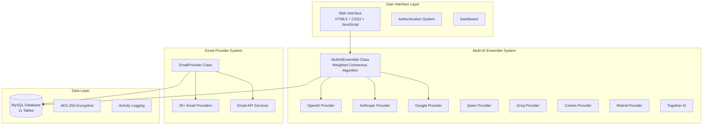

# ROTZ Email Butler - AI-Powered Email Management System


## 🚀 Overview

ROTZ Email Butler is a comprehensive AI-powered email management system that revolutionizes how you handle your emails. Using advanced multi-AI ensemble technology, it automatically categorizes, prioritizes, and processes your emails from multiple providers with unprecedented accuracy.

## ✨ Key Features

### 🤖 Multi-AI Ensemble System
- **8+ AI Providers** with real API integrations
- **Individual Enable/Disable Toggles** for each AI model
- **Weighted Consensus Algorithm** for superior accuracy
- **Cost Tracking & Performance Monitoring**
- **Real-time Testing & Validation**

**Supported AI Providers:**
- OpenAI (GPT-4, GPT-3.5-turbo)
- Anthropic (Claude 3.5 Sonnet, Haiku, Opus)
- Google (Gemini Pro, Ultra, Flash)
- Qwen (Qwen2.5-Max, QVQ-72B)
- Groq (Llama 3.1, Mixtral)
- Cohere (Command R+, Command R)
- Mistral (Large, Medium, Small)
- Together AI (Open-source models)

### 📧 Comprehensive Email Provider Support
- **20+ Email Providers** with real IMAP/SMTP connections
- **Dynamic Configuration Forms** based on provider type
- **OAuth & App Password Support**
- **Real-time Sync & Status Monitoring**

**Supported Email Providers:**
- **Popular:** Gmail, Outlook, Office 365, Yahoo, iCloud
- **Privacy-Focused:** ProtonMail, Tutanota
- **Business:** Fastmail, Zoho
- **International:** AOL, Yandex, GMX, Mail.com
- **API Services:** Mailgun, SendGrid, Amazon SES, Postmark, Mandrill, SparkPost
- **Custom:** IMAP, Exchange, API configurations

### 🎯 Advanced Email Processing
- **Smart Categorization** (Work, Personal, Marketing, Finance)
- **Priority Detection** (High, Medium, Low)
- **Sentiment Analysis** (Positive, Negative, Neutral)
- **Follow-up Automation** with intelligent reminders
- **AI-powered Summaries** and insights

### 🛡️ Enterprise-Grade Security
- **AES-256 Encryption** for credential storage
- **bcrypt Password Hashing**
- **CSRF Protection** with token validation
- **Rate Limiting** and API abuse prevention
- **Input Validation** against XSS & SQL injection
- **Activity Logging** with complete audit trail

### ⚙️ Admin Features
- **WordPress-style Setup Wizard**
- **Registration Control Toggle** (enable/disable user registration)
- **User Management** with role-based access
- **System Health Monitoring**
- **Performance Analytics** and insights

## 🏗️ Architecture



## 📋 Requirements

### System Requirements
- **PHP 8.1+** with extensions:
  - mysqli or PDO MySQL
  - curl
  - json
  - mbstring
  - openssl
  - imap
  - zip
- **MySQL 8.0+** or MariaDB 10.4+
- **Apache 2.4+** or Nginx 1.18+
- **Composer** for dependency management

### Recommended Server Specs
- **CPU:** 2+ cores
- **RAM:** 4GB+ (8GB recommended for heavy processing)
- **Storage:** 10GB+ SSD
- **Network:** Stable internet connection for AI APIs

## 🚀 Installation

### 1. Download & Extract
```bash
git clone https://github.com/rotzmediagroup/rotz-email-butler-php.git
cd rotz-email-butler-php
```

### 2. Install Dependencies
```bash
composer install --no-dev --optimize-autoloader
```

### 3. Set Permissions
```bash
chmod 755 logs cache uploads
chmod +x cron/email_processor.php
```

### 4. Configure Web Server

#### Apache (.htaccess included)
```apache
<VirtualHost *:80>
    DocumentRoot /path/to/rotz-email-butler-php
    ServerName your-domain.com
    
    <Directory /path/to/rotz-email-butler-php>
        AllowOverride All
        Require all granted
    </Directory>
</VirtualHost>
```

#### Nginx
```nginx
server {
    listen 80;
    server_name your-domain.com;
    root /path/to/rotz-email-butler-php;
    index index.php;
    
    location / {
        try_files $uri $uri/ /index.php?$query_string;
    }
    
    location ~ \.php$ {
        fastcgi_pass unix:/var/run/php/php8.1-fpm.sock;
        fastcgi_index index.php;
        fastcgi_param SCRIPT_FILENAME $document_root$fastcgi_script_name;
        include fastcgi_params;
    }
}
```

### 5. Run Setup Wizard
1. Navigate to `http://your-domain.com/setup/`
2. Follow the 5-step installation process:
   - **Step 1:** System Requirements Check
   - **Step 2:** Database Configuration
   - **Step 3:** Admin User Creation
   - **Step 4:** Application Configuration
   - **Step 5:** Installation Complete

## ⚙️ Configuration

### Database Setup
The setup wizard will create all necessary tables:
- `users` - User accounts and authentication
- `email_accounts` - Connected email accounts
- `emails` - Processed email data
- `ai_providers` - AI provider configurations
- `follow_ups` - Follow-up reminders
- `activity_logs` - System activity tracking
- `settings` - Application settings
- `sessions` - User session management
- `rate_limits` - API rate limiting
- `email_rules` - Custom email rules
- `integrations` - Third-party integrations

### AI Provider Setup
1. **Login to Admin Panel**
2. **Navigate to AI Providers**
3. **Add Provider:**
   - Select provider (OpenAI, Anthropic, etc.)
   - Choose model
   - Enter API key
   - Enable/disable toggle
   - Test connection

### Email Account Setup
1. **Navigate to Email Accounts**
2. **Add Account:**
   - Select provider type
   - Enter email address
   - Configure authentication (OAuth/App Password)
   - Test connection
   - Enable sync

### Automated Processing
Set up the cron job for automated email processing:
```bash
# Add to crontab (crontab -e)
*/15 * * * * /usr/bin/php /path/to/rotz-email-butler-php/cron/email_processor.php
```

## 🎛️ Admin Controls

### Registration Management
- **Enable/Disable Registration:** Control whether new users can register
- **User Approval:** Require admin approval for new accounts
- **Role Management:** Assign user roles and permissions

### AI Provider Management
- **Individual Toggles:** Enable/disable specific AI models
- **Cost Monitoring:** Track API usage and costs
- **Performance Analytics:** Monitor accuracy and response times
- **Bulk Operations:** Enable/disable multiple providers

### System Monitoring
- **Health Dashboard:** Real-time system status
- **Performance Metrics:** Email processing statistics
- **Error Logging:** Comprehensive error tracking
- **Activity Audit:** Complete user activity logs

## 📊 Analytics & Reporting

### Email Analytics
- **Processing Accuracy:** AI confidence scores and accuracy metrics
- **Category Distribution:** Email categorization breakdown
- **Priority Analysis:** High/medium/low priority distribution
- **Volume Trends:** Daily/weekly/monthly email volume

### AI Performance
- **Provider Comparison:** Performance metrics across AI providers
- **Cost Analysis:** API usage costs and optimization
- **Response Times:** AI processing speed analytics
- **Accuracy Tracking:** Consensus algorithm effectiveness

### User Activity
- **Login Analytics:** User engagement metrics
- **Feature Usage:** Most used features and workflows
- **Error Rates:** System reliability metrics
- **Performance Trends:** System performance over time

## 🔧 API Documentation

### Authentication
```php
POST /api/auth/login
{
    "email": "user@example.com",
    "password": "password"
}
```

### AI Providers
```php
GET /api/ai-providers          # List providers
POST /api/ai-providers         # Add provider
PUT /api/ai-providers/{id}     # Update provider
DELETE /api/ai-providers/{id}  # Delete provider
POST /api/ai-providers/{id}/toggle  # Toggle enable/disable
POST /api/ai-providers/{id}/test     # Test provider
```

### Email Accounts
```php
GET /api/email-accounts        # List accounts
POST /api/email-accounts       # Add account
PUT /api/email-accounts/{id}   # Update account
DELETE /api/email-accounts/{id} # Delete account
POST /api/email-accounts/{id}/sync # Sync emails
```

### Email Processing
```php
GET /api/emails               # List emails
POST /api/emails/sync-all     # Sync all accounts
POST /api/emails/process      # Process with AI
```

## 🛡️ Security Features

### Data Protection
- **Encryption at Rest:** All sensitive data encrypted with AES-256
- **Secure Transmission:** HTTPS/TLS for all communications
- **API Key Security:** Encrypted storage of all API credentials
- **Password Security:** bcrypt hashing with salt

### Access Control
- **Role-Based Access:** Admin, user, and custom roles
- **Session Management:** Secure session handling
- **CSRF Protection:** Token-based CSRF prevention
- **Rate Limiting:** API abuse prevention

### Monitoring & Auditing
- **Activity Logging:** Complete audit trail
- **Failed Login Tracking:** Brute force protection
- **System Health Monitoring:** Real-time security status
- **Automated Alerts:** Security incident notifications

## 🚀 Performance Optimization

### Caching
- **Database Query Caching:** Optimized database performance
- **API Response Caching:** Reduced AI API calls
- **Static Asset Caching:** Improved page load times

### Database Optimization
- **Indexed Queries:** Optimized database indexes
- **Connection Pooling:** Efficient database connections
- **Query Optimization:** Streamlined database operations

### AI Processing
- **Parallel Processing:** Concurrent AI provider calls
- **Smart Batching:** Efficient email processing
- **Cost Optimization:** Intelligent provider selection

## 📞 Support & Documentation

### Getting Help
- **Documentation:** Comprehensive setup and usage guides
- **API Reference:** Complete API documentation
- **Troubleshooting:** Common issues and solutions
- **Community Support:** User community and forums

### Contributing
- **Bug Reports:** Issue tracking and resolution
- **Feature Requests:** Community-driven development
- **Code Contributions:** Open-source collaboration
- **Documentation:** Help improve documentation

## 📄 License

This project is licensed under the MIT License - see the [LICENSE](LICENSE) file for details.

## 🙏 Acknowledgments

- **AI Providers:** OpenAI, Anthropic, Google, Qwen, Groq, Cohere, Mistral, Together AI
- **Email Providers:** Gmail, Outlook, Yahoo, iCloud, ProtonMail, and many others
- **Open Source Libraries:** Composer packages and dependencies
- **Community:** Contributors and users who make this project possible

---

**ROTZ Email Butler** - Revolutionizing email management with AI-powered intelligence.

For more information, visit our [GitHub repository](https://github.com/rotzmediagroup/rotz-email-butler-php) or [documentation site](https://docs.rotz-email-butler.com).

